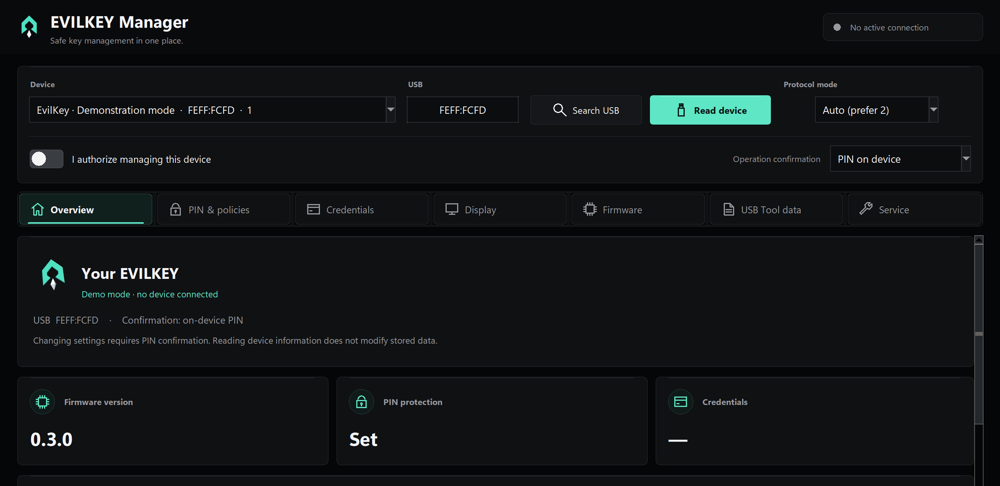

  

  <a href="https://github.com/mwr666/EvilKey-firmware">Firmware and device GUI</a> ·
  <strong>Windows Manager</strong> ·
  <a href="https://github.com/mwr666/EvilKey-examples">microSD examples</a> ·
  <a href="https://hackaday.io/project/206807-evilkey-i-needed-a-fido2-key-then-the-maker-brain-took-over">Hackaday project</a> ·
  <a href="https://www.printables.com/model/1855790-evilkey-v1-enclosure-waveshare-esp32-s3-touch-amol">Printable V1 enclosure</a>

  

# EvilKey Manager

The Windows Manager **1.1.6** provides FIDO PIN/policy controls, credential management, display settings, firmware configuration export and offline USB Tool decoding. It connects in the normal FIDO USB role. This source now targets **firmware 0.6.1**, including its launcher and BLE controls. Exit BLE Gamepad, BLE AirMouse or USB AirMouse to return to FIDO before connecting Manager.

Firmware source is downloaded separately from [EvilKey firmware](https://github.com/mwr666/EvilKey-firmware). The EXE contains no firmware or game source. The existing public 1.1.6 executable and its release are retained. This update synchronizes source configuration/version labels; it does not imply a rebuilt EXE. Run the updated source installation for configuration export with current labels. Its checks open no USB.

[▶ Watch the real-device GUI Short](https://youtube.com/shorts/MK2NCrWpuXo) — silent footage of the touchscreen in use on the prototype, with an animated logo ending. The Windows Manager interface appears below.

## Air Mouse on the device

[▶ Watch the Air Mouse Short](https://youtube.com/shorts/b0x_XzGABB8) — real device footage of hold-to-move pointer steering, touchscreen clicks and scrolling. Air Mouse is a separate USB role; hold **EXIT** on the key to return to the FIDO2 role before connecting the Windows Manager. The Manager does not control the cursor.

[▶ Watch the USB Tool Short](https://youtube.com/shorts/k0a0o6s1Ayg)

USB Tool is a separate role selected on the key. A script starts only after selection and **RUN**, never merely on connection. It can send scripted HID input, save results on microSD and use Keystroke Reflection when a mass-storage drive is unavailable; scripts can move files or collect data within host permissions and defenses. The Short shows only a harmless Notepad HID test on the owner's computer, not file transfer or data collection. The Windows Manager does not run the payload; its *USB Tool data* tab inspects saved results offline.

## Firmware 0.6.1 compatibility

Firmware 0.6.1 synchronizes Apps/Settings orbit animations. The app ABI and
Manager protocol remain unchanged. This source release updates configuration
export/demo labels; the existing 1.1.6 EXE remains available in its original release.

## Watch Apps on the real device

[▶ Watch the Apps Short](https://youtube.com/shorts/e-bcwSlzdcg)

I needed a FIDO2 key. It now runs falling blocks and pinball. Apparently I was left unsupervised. This silent Short shows **EvilBlocks and EvilPinball on the real PCB V1 prototype**: select an app from microSD, press **RUN**, then play using the touchscreen. The captions and 3D logo/glitch outro are edited; the gameplay is filmed during development, rather than a benchmark of the latest app builds.

Firmware **0.6.1** runs independent ABI v4 `.ekapp` packages from `/evilkey/apps/`. Swipe left from Home for the animated Apps screen, up/down for 3×3 icon pages and tap an app to run it. Packages require names/icons and the shared corner exit profile; app state is saved beside the package as `<id>.save`. Updates within the supported ABI only replace a file on the card. Game source/packages remain separately licensed and are not included here. The tested PCB V1 reports one touch contact. [Latest firmware and MIT SDK](https://github.com/mwr666/EvilKey-firmware/releases/tag/v0.6.1). The video shows the earlier launch flow used when filmed.

What app would you put on a device like this? Useful tools and gloriously unnecessary experiments are welcome.

Apps run on the key; the Windows Manager does not launch or play them.

## Hardware for the PCB V1 USB Tool demo

| Quantity | Component |
| --- | --- |
| 1 | Waveshare ESP32-S3 Touch AMOLED 1.64, **PCB V1** |
| 1 | Short data-capable USB-C cable/loop (Unitek C14179ABK-style in the prototype) |
| 1 | Printed V1 enclosure (the current prototype is home printed) |
| 4 | M2 × 5 mm screws for the module |
| 1 | M5 × 10 mm flat-point grub screw for the cable loop |
| 1 | **FAT32-formatted microSD card** for USB Tool scripts |

The microSD card is needed for the device's `hello_world.duck` demonstration; FIDO2 and Air Mouse work without it. Copy the [public examples](https://github.com/mwr666/EvilKey-examples) `duckyscripts/` tree to the card root; the tested script is `/duckyscripts/test/hello_world.duck`. Card capacity is not specified. The Windows Manager does not require a microSD card for its normal FIDO-role connection. See the [Hackaday component list](https://hackaday.io/project/206807/components).

## Interface preview

  

The Manager overview shown with in-memory demonstration data; no USB device was connected for this capture.

### PIN entry on EvilKey

  

Real PCB V1 prototype. Compatible built-in user-verification requests use the key's touchscreen; clients may instead request host-side ClientPIN. The Manager's own PIN controls are separate.

## Run and build

For a source installation, use `manager/install.cmd`, then `manager/start_admin.cmd`. The application requires Windows, 64-bit Python with Tk and the pinned packages in `manager/requirements.txt`. To build the portable EXE, run `scripts/build_windows.ps1` from PowerShell. Its frozen self-test does not open USB, though Windows may ask for UAC approval. See [build details](docs/BUILD.md) and the [Manager guide](manager/README.md).

## Related projects

- [EvilKey firmware](https://github.com/mwr666/EvilKey-firmware) — open AGPLv3 firmware, LVGL touch interface and the source used by configuration export.
- [EvilKey examples](https://github.com/mwr666/EvilKey-examples) — original microSD scripts under separate noncommercial terms.
- [Printable V1 enclosure](https://www.printables.com/model/1855790-evilkey-v1-enclosure-waveshare-esp32-s3-touch-amol) — digital STL and 3MF case files for the Waveshare PCB V1, sold separately on Printables.

I welcome useful suggestions for Manager controls and workflows. Open an issue with the expected behavior and a way to verify it.

Voluntary support is available through [GitHub Sponsors](https://github.com/sponsors/mwr666). Sponsorship is not a software purchase or a kit preorder.

## License

The original Manager application, artwork and Manager-specific build code are source available for private noncommercial use under [EvilKey Manager License](LICENSE.md). Commercial use requires separate written permission from Michał Wojciechowski. Bundled third-party components retain their own terms in [`manager/licenses/`](manager/licenses/). This Manager license does not alter the firmware's AGPLv3 terms.
