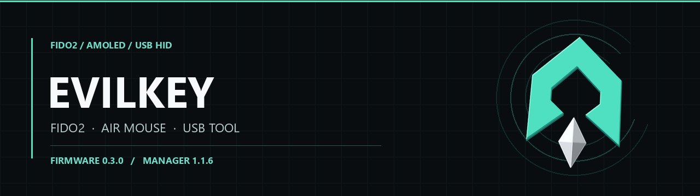

  

  <a href="https://github.com/mwr666/EvilKey-firmware">Firmware and device GUI</a> ·
  <strong>Windows Manager</strong> ·
  <a href="https://github.com/mwr666/EvilKey-examples">microSD examples</a>

  

# EvilKey Manager

The Windows Manager provides FIDO PIN and policy controls, credential management, display settings, firmware configuration export and offline USB Tool data decoding. It connects to EvilKey in its normal FIDO USB role. Firmware source is supplied separately through [EvilKey firmware](https://github.com/mwr666/EvilKey-firmware); the Manager executable does not embed it.

## Run and build

For a source installation, use `manager/install.cmd`, then `manager/start_admin.cmd`. The application requires Windows, 64-bit Python with Tk and the pinned packages in `manager/requirements.txt`. To build the portable EXE, run `scripts/build_windows.ps1` from PowerShell. Its frozen self-test does not open USB, though Windows may ask for UAC approval. See [build details](docs/BUILD.md) and the [Manager guide](manager/README.md).

## Related projects

- [EvilKey firmware](https://github.com/mwr666/EvilKey-firmware) — open AGPLv3 firmware, LVGL touch interface and the source used by configuration export.
- [EvilKey examples](https://github.com/mwr666/EvilKey-examples) — original microSD scripts under separate noncommercial terms.

I welcome useful suggestions for Manager controls and workflows. Open an issue with the expected behavior and a way to verify it.

Voluntary support is available through [GitHub Sponsors](https://github.com/sponsors/mwr666). Sponsorship is not a software purchase or a kit preorder.

## License

The original Manager application, artwork and Manager-specific build code are source available for private noncommercial use under [EvilKey Manager License](LICENSE.md). Commercial use requires separate written permission from Michał Wojciechowski. Bundled third-party components retain their own terms in [`manager/licenses/`](manager/licenses/). This Manager license does not alter the firmware's AGPLv3 terms.
